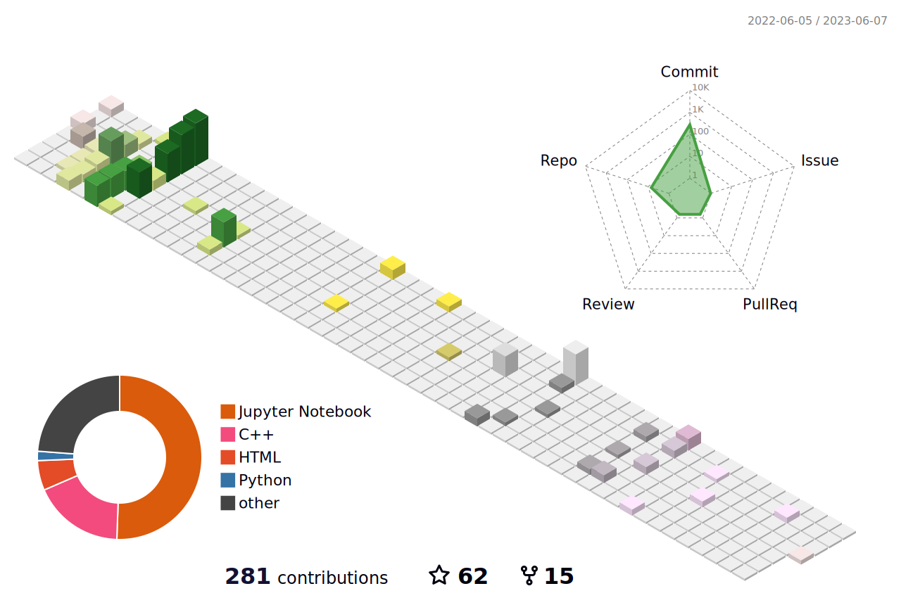

<p align="center">
  <a href="https://git.io/typing-svg"></a>
</p>

<p align='center'>
  Here is my <a href="https://drive.google.com/file/d/1uCdCnkuZE3QGYgitYwHrQXG5E3R5tsZw/view?usp=drive_link" target="_blank">CV</a>
</p>

<h2 align="left">💻 My Workspace</h2>
<p align='left'>
  
  
  
  
  
</p>

<h2 align="left">🛠️ Languages and Tools</h2>
<p align='left'>
  
  
  
  
  
  
  
  
  
  
  
  
</p>

## 🏛️ Education
- 📖 **M.S. Mechanical Engineering (Program of System Control)**\
📆 2021 - 2023\
🏫 **National Taiwan University** - Taipei, Taiwan

- 📖 **B.S. Electrical Engineering (Double Major)**\
📆 2018 - 2021\
🏫 **National Taiwan Normal University** - Taipei, Taiwan

- 📖 **B.S. Mechatronic Engineering (Main Major)**\
📆 2017 - 2021\
🏫 **National Taiwan Normal University** - Taipei, Taiwan

<h2 align="left">📈 LeetCode Stats</h2>

[](https://leetcode.com/Offliner/)

<h2 align="left">📊 Github Contributions</h2>


<!--  -->

<h2 align="left">⏱️ WakaTime</h2>

<!--START_SECTION:waka-->

```txt
C             17 hrs 37 mins  ██████████████▓░░░░░░░░░░   58.27 %
V             7 hrs 27 mins   ██████░░░░░░░░░░░░░░░░░░░   24.66 %
Markdown      1 hr 22 mins    █░░░░░░░░░░░░░░░░░░░░░░░░   04.54 %
Batchfile     1 hr 8 mins     █░░░░░░░░░░░░░░░░░░░░░░░░   03.76 %
Makefile      48 mins         ▓░░░░░░░░░░░░░░░░░░░░░░░░   02.69 %
```

<!--END_SECTION:waka-->

## 📃 Daily digest in arXiv Computer Science and Hardware Architecture

