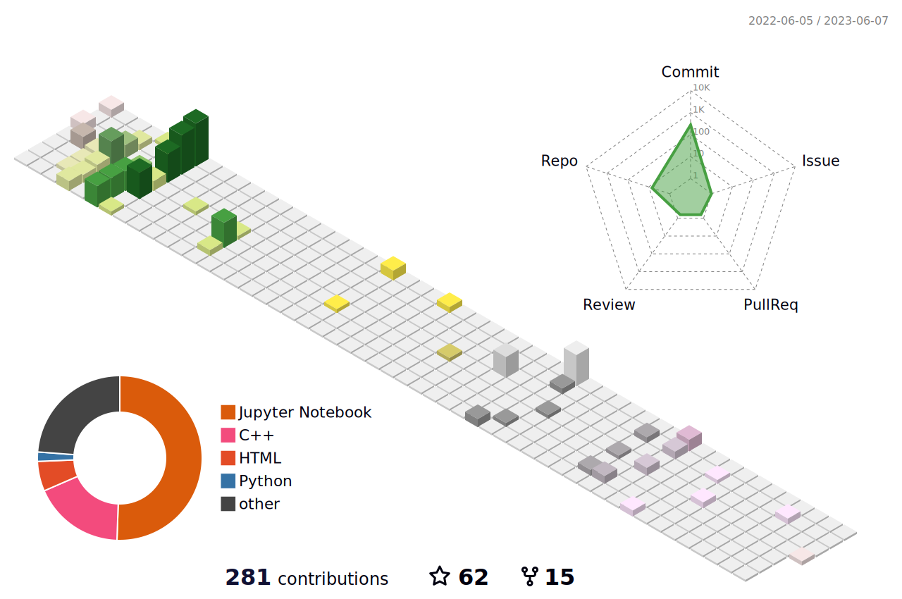

  

  A problem is a chance for you to do your best.

<h2 align="left">My Workspace</h2>

  <b>OS</b> 
  
  
  
    
  <b>Device</b> 
  
    
  <b>Hardware</b> 
  
  
  

<h2 align="left">Languages and Tools</h2>

  <b>HDL</b> 
  
  
    
  <b>Programming</b> 
  
  
  
    
  <b>AI/ML</b> 
  
  
    
  <b>RTL Simulation & Debug</b> 
  
  
  
    
  <b>Synthesis and Verification</b> 
  
    
  <b>Physical Design and Post-Layout Simulation</b> 
  

## Work Experience

<table>
<tr>
<td width="120" valign="top" align="center">

 
</td>
<td valign="top">

**Senior Engineer** · Silicon Motion\
2024 – Now

</td>
</tr>
</table>

## Education

<table>
<tr>
<td width="100" valign="top">

</td>
<td valign="top">

**M.S. Mechanical Engineering (Program of System Control)**\
2021 – 2023\
**National Taiwan University** — Taipei, Taiwan

</td>
</tr>
<tr>
<td width="100" valign="top">

</td>
<td valign="top">

**B.S. Electrical Engineering (Double Major)**\
2018 – 2021\
**National Taiwan Normal University** — Taipei, Taiwan

</td>
</tr>
<tr>
<td width="100" valign="top">

</td>
<td valign="top">

**B.S. Mechatronic Engineering (Main Major)**\
2017 – 2021\
**National Taiwan Normal University** — Taipei, Taiwan

</td>
</tr>
</table>

<h2 align="left">Github Contributions</h2>

<!--  -->

<h2 align="left">WakaTime</h2>

## Daily digest in arXiv Computer Science and Hardware Architecture

